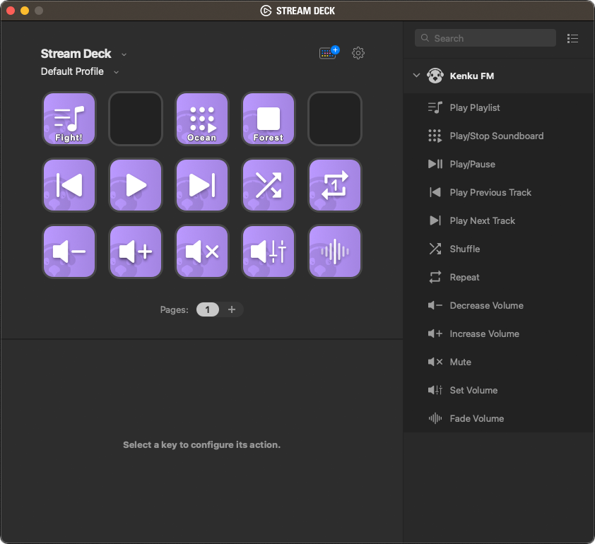
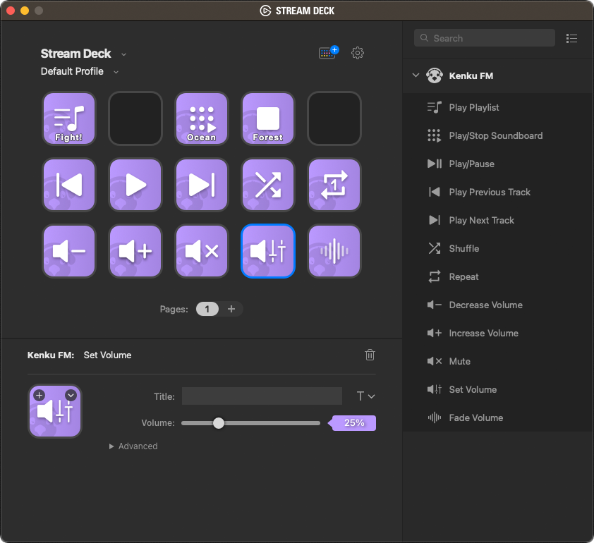
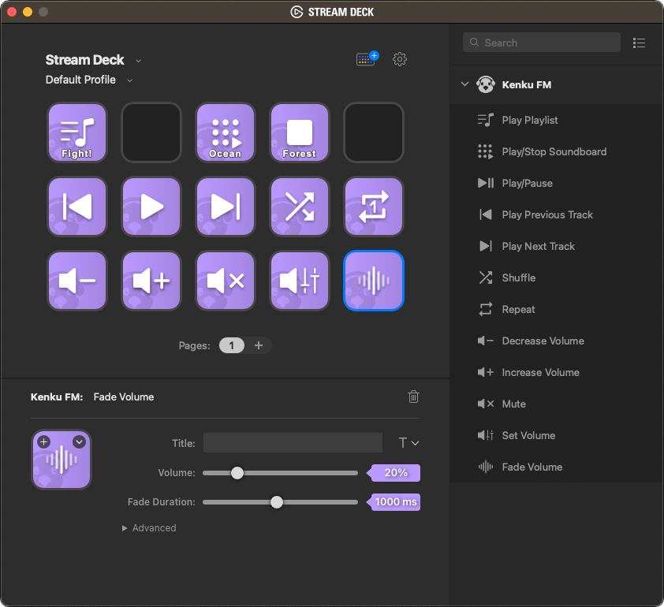

# Kenku FM Stream Deck Plugin

[Stream Deck](https://www.elgato.com/en/stream-deck) plugin for [Kenku FM](https://kenku.fm).

This plugin is based on the official Kenku FM Stream Deck Plugin. It is primarily a project for me to learn how to develop plugins for stream deck. All features from the official plugin are present, plus a few new ones (see below for details). The most notable difference is the separation of the playback controls into separate actions. This was intended to be able to test button states as well as more visually distinguish actions within multi-action buttons.

## Set Volume

This new action allows setting the volume to a predetermined value. This can be particularly useful when placed in a multi-action button that issues a series of commands to the Kenku FM player. For example, a multi-action button could be set up to set the volume to 15%, set the repeat mode to "Repeat Track", then play a specific playlist or track.

## Fade Volume

This new action allows easing the volume from it's current level to a predetermined value over a desired period of time (from 0.5s – 2s). This can be particularly useful when placed in a multi-action button that issues a series of commands to the Kenku FM player. For example, a sequence could be set up to fade the volume to 0% and *then* stop playback to avoid a harsh cut-off of the audio.

